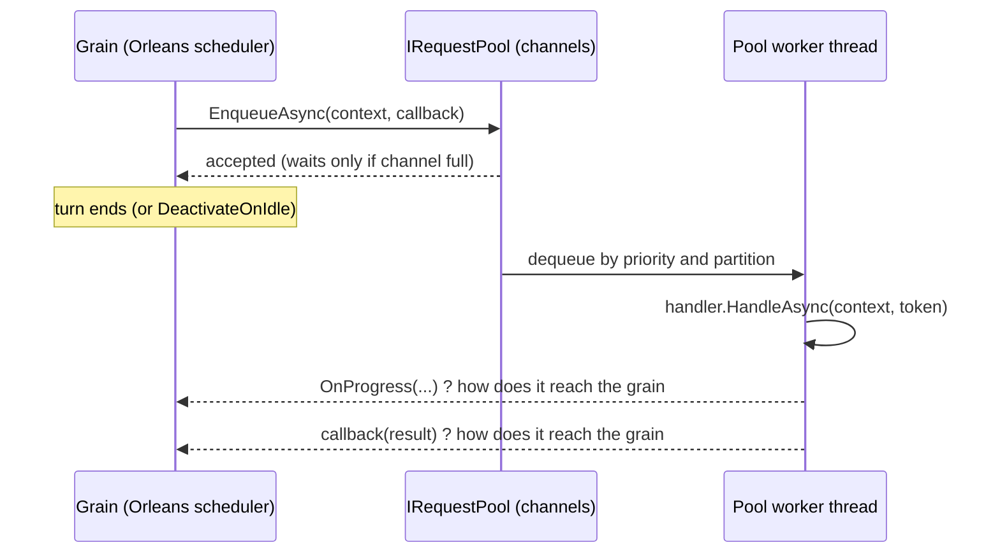
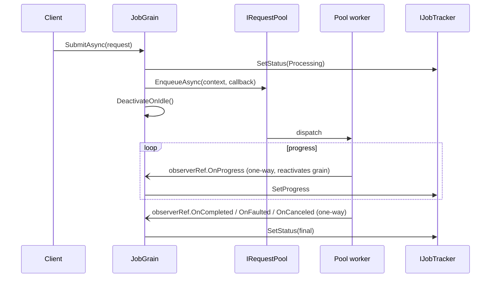
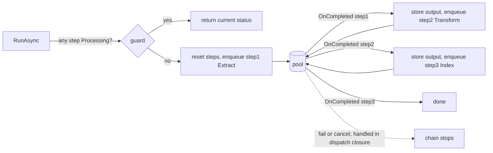
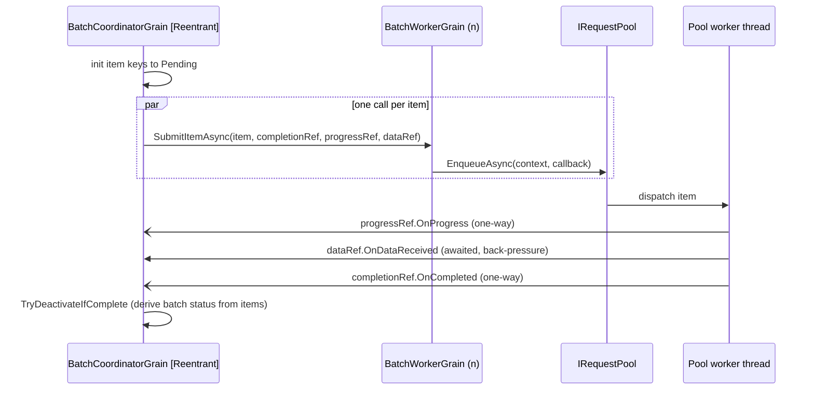
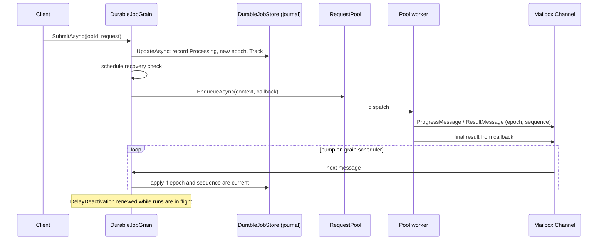
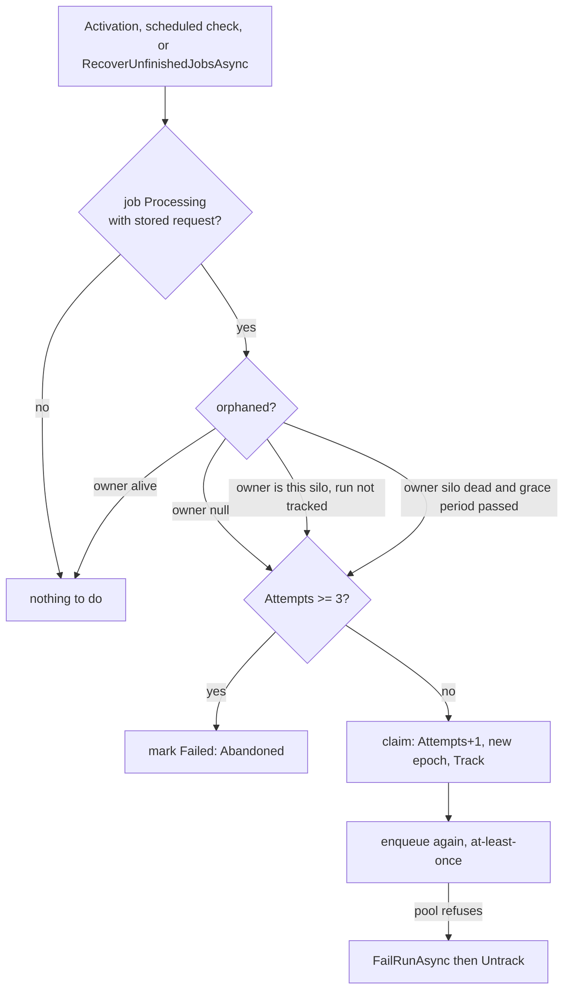
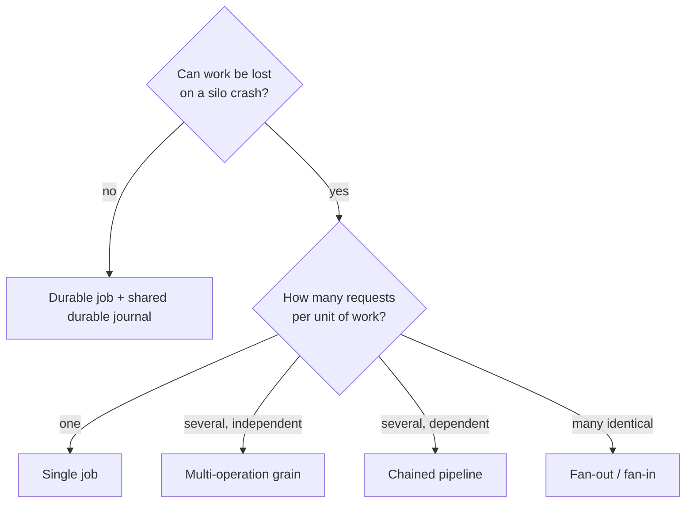

# Dispatching Orleans grain requests to `IRequestPool` — pattern reference

This document describes the patterns used in this solution for a grain to hand work to an `IRequestPool`, how each one returns results to the grain, and how they compare. It is meant as a reference for using Orleans with `IRequestPool` in other solutions, including patterns this solution does **not** implement (section 7).

Sources: the code under `src/Core` and `src/Demo.Orleans` (file references are relative to `src/`), and the Microsoft Learn Orleans documentation for the framework baseline (section 2). `IRequestPool` is not an Orleans API. Everything about it comes from this repository, not from external documentation.

---

## 1. Concepts you need first

### 1.1 What `IRequestPool` is

An in-process, per-silo, priority-aware work queue with a fixed number of workers (`Core/IRequestPool.cs`, `Core/RequestPoolService.cs`).

| Aspect | Behavior |
|---|---|
| Submit | `ValueTask EnqueueAsync(RequestContext, RequestCompletedCallback, CancellationToken)`, plus a closure-free `<TState>` overload |
| What the returned task means | The request was **accepted into a channel**, not that it finished. It only waits asynchronously when the bounded channel is full (back-pressure, `FullMode = Wait` by default) |
| Completion | A callback invoked on **whichever pool worker thread** finished the request, outside any Orleans scheduler |
| Awaitable variant | `RequestPoolExtensions.EnqueueAsync(pool, context, ct) : Task<RequestResult>` wraps the callback in a `TaskCompletionSource` (`Core/RequestPoolExtensions.cs`) |
| Priorities | `Low`, `Normal`, `High`; three bounded channels drained by weighted round-robin (default weights 1:3:5) |
| Fairness | With `PartitionFairnessEnabled`, `RequestContext.PartitionKey` gives each key its own bounded channel so one key cannot starve the others |
| Progress | `RequestContext.OnProgress` is a synchronous `void` delegate called from the worker thread |
| Cancellation | `IRequestPoolMonitor.TryCancelRequest(id)` only cancels a request that is still **queued**. A running handler stops only through the `CancellationToken` passed to `HandleAsync` (per-request timeout, or shutdown drain) |
| Request ids | Must be 1–256 chars, no control characters, and unique among **pending** (queued, not yet picked up) requests. A duplicate throws `ArgumentException` |
| Durability | None. Queued and running work is lost when the silo dies |
| Handler lookup | `MediatorRequestDispatcher` routes by the static type argument of `RequestContext<TData>`. A `RequestContext<IJobRequest>` has no handler: always construct the concrete type |

### 1.2 The core problem every pattern solves

The pool calls back on a **thread-pool worker thread**, not on the grain's scheduler. A grain therefore has to answer one question: *how does the result get back into the grain safely?* The patterns below differ mainly in that answer.



---

## 2. Framework baseline (Orleans)

These behaviors, from Microsoft Learn (pages current as of early 2026), explain why the patterns look the way they do. Behavior may change in later Orleans versions.

| Mechanism | Scope | Effect |
|---|---|---|
| Default | Per activation | Single-threaded, non-reentrant: each request runs to completion before the next starts. Call cycles (A calls B calls A) time out |
| `[Reentrant]` | Class | Turns of different requests may interleave at `await` points. Never parallel: still one turn at a time |
| `[AlwaysInterleave]` | Interface method | That method may interleave with anything |
| `[ReadOnly]` | Interface method | Interleaves only with other `[ReadOnly]` calls |
| `[MayInterleave(predicate)]` | Class | Per-request decision. The closest documented per-request dispatch mechanism |
| `RequestContext.AllowCallChainReentrancy()` | Call site | Admits callers further down the current call chain, until the scope is disposed |
| `[OneWay]` | Interface method | Returns immediately; no completion, failure or delivery signal. Saves the response message. Method must return `Task` or `ValueTask` |
| `[StatelessWorker]` | Class | Local, auto-scaling pool of activations per silo (default cap: CPU cores). Not individually addressable; no state between requests |
| Task scheduling | Grain code | `await`, `ContinueWith`, `Task.Factory.StartNew(...).Unwrap()` stay on the grain scheduler. `Task.Run` and `ConfigureAwait(false)` leave it |

Sources:
- <https://learn.microsoft.com/dotnet/orleans/grains/request-scheduling>
- <https://learn.microsoft.com/dotnet/orleans/grains/reentrancy>
- <https://learn.microsoft.com/dotnet/orleans/grains/oneway>
- <https://learn.microsoft.com/dotnet/orleans/grains/stateless-worker-grains>
- <https://learn.microsoft.com/dotnet/orleans/grains/external-tasks-and-grains>

---

## 3. Infrastructure shared by every pattern

- **Registration** (`Demo.Orleans/Program.cs`): `AddMediatorRequestPool(...)` plus one `AddRequestHandler<TRequest, THandler>()` per request type. Handlers are **singletons**, so they must be stateless and thread-safe. The demo uses `BoundedCapacity = 500`, `PartitionFairnessEnabled = true`, `PriorityAgingThreshold = 30s`.
- **Grains inject the pool directly** (`IRequestPool`, `IRequestPoolMonitor`) from the silo's DI container through primary constructors. There is no grain service on the submission path.
- **Dedicated scheduler** (`Program.cs`): the pool runs on a `QueuedTaskScheduler` with 4 below-normal-priority threads and a sub-queue per priority, so handler CPU work does not compete with Orleans continuations. Toggle with `RequestPoolScheduler:Enabled=false`. Disable it for purely async I/O handlers, where dedicated threads only add overhead.
- **Observer interfaces** (`IJobCompletionObserver`, `IJobProgressObserver`, `IJobDataObserver`): a grain implements them itself and captures `this.AsReference<T>()` **before** enqueueing. A call through that reference from a worker thread goes through Orleans messaging and reactivates the grain if it has deactivated. `OnCompleted/OnCanceled/OnFaulted/OnProgress` are `[AlwaysInterleave, OneWay]`; `IJobDataObserver.OnDataReceived` is `[AlwaysInterleave]` but deliberately **not** one-way, so the worker awaits it (back-pressure).
- **`IJobTracker`** (`InMemoryJobTracker`): a process-wide `ConcurrentDictionary`-backed store of status, progress and typed output. It exists because it is safe to write from both grain turns and pool worker threads. It is **in-memory and per silo**.
- **Serialization:** everything crossing a grain boundary needs `[GenerateSerializer]` and `[property: Id(n)]`; exceptions only serialize by default for BCL, `Microsoft.*` and `Azure.*` namespaces.

---

## 4. The patterns

### 4.1 Single fire-and-forget job — `JobGrain`

One grain per job id. Submit, enqueue, deactivate; the result comes back by one-way observer calls.

```csharp
tracker.SetStatus(jobId, JobStatus.Processing);              // BEFORE enqueue
var completionRef = this.AsReference<IJobCompletionObserver>();
await pool.EnqueueAsync(context, async result =>
{
    if (result.Error is OperationCanceledException) await completionRef.OnCanceled(jobId);
    else if (result.Error is not null)              await completionRef.OnFaulted(jobId, result.Error);
    else                                            await completionRef.OnCompleted(jobId, output);
});
DeactivateOnIdle();
```



- **Idempotency:** skip if tracker status is `Processing`. A finished job id can be resubmitted.
- **Cancel:** `monitor.TryCancelRequest(jobId)` (request id = grain key). Queued only; if the handler is running it returns false.
- **Why status is set before enqueue:** a fast handler's `[AlwaysInterleave]` completion turn can run while `SubmitAsync` is still awaiting the enqueue; setting `Processing` afterwards would overwrite `Completed`.
- **Must switch on the concrete request type** to build `RequestContext<TConcrete>`.

### 4.2 Several independent operations on one grain — `NotificationGrain`, `ReportGrain`

One grain per notification/report; each operation (email/sms/push, generate/review/publish) is its own request type with its own priority. A generic private helper (`DispatchChannelAsync`, `DispatchOperationAsync<TRequest>`) does the dispatch.

- **Composite key:** `"{id}:{operation}"` is simultaneously the pool request id, the tracker key and the cancel key, so nothing needs parsing.
- **Completion:** the callback closure captures the exact key and writes the tracker itself, then calls the one-way observer (logging only). Cancel and failure are therefore attributed to the right operation without guessing.
- **Progress:** `NotificationGrain` uses a progress observer; `ReportGrain` writes the tracker directly from the worker thread (the tracker is thread-safe).
- **Idempotency:** per operation. Notification skips `Pending/Processing/Completed`; Report skips `Processing/Completed`. Failed or cancelled operations re-dispatch.
- **Cancel:** loop over the keys and `TryCancelRequest` each; running operations are not interrupted.
- **Note:** no `PartitionKey` is set, so these requests share the default fairness partition.

### 4.3 Chained sequential pipeline — `DocumentProcessingGrain` (Extract → Transform → Index)

Each step's typed output feeds the next step's request. The chain advances inside the observer turn.

- Step keys `"{pipelineId}:step1|step2|step3"` double as request ids.
- `OnCompleted` maps the key back to a step, stores status and output in the tracker, then dispatches the next step, which reads the previous output with `tracker.GetOutput(...)`.
- Cancel and failure are handled in the **dispatch closures** (which captured the exact step key). The observer's `OnCanceled`/`OnFaulted` are deliberate no-ops: guessing the step would race with a restart under `[AlwaysInterleave]`.
- **Restart protection:** `RunAsync` refuses to restart if **any** step is `Processing` (not only step 1), otherwise a stale `OnCompleted` from step 2 or 3 would find reset outputs and break the new run. `OnCompleted` also discards a callback whose step status is `Unknown` (reset by a restart).
- Any failure stops the chain; a later `RunAsync` restarts from step 1.



### 4.4 Fan-out / fan-in — `BatchCoordinatorGrain` + `BatchWorkerGrain`

A coordinator grain splits a batch across worker grains; the workers (not the coordinator) enqueue to the pool.

- The coordinator is `[Reentrant]` and implements all three observer interfaces. It fans out with `Task.WhenAll` over `SubmitItemAsync(itemKey, ..., completionRef, progressRef, dataObserverRef)`, passing its **own observer references as arguments**; the worker captures them in the callback closure.
- Item keys `"{batchId}:item-{i}"` are pre-initialised to `Pending` so a poller sees the full list. All items share `PartitionKey = batchId`.
- **Fan-in:** `GetSummaryAsync` derives the batch status from the item keys in the tracker (Failed > Cancelled > Completed once all are terminal). `TryDeactivateIfComplete()` finalises and deactivates the coordinator.
- **Result delivery:** on success the worker awaits `OnDataReceived` before `OnCompleted`, so a slow coordinator slows its workers (intentional back-pressure).
- **Workers do not call `DeactivateOnIdle()`:** other items queued for the same activation would race with it; Orleans idle collection handles them.
- **Cancel:** coordinator and worker each cancel their own queued items; the batch is `Cancelled` only if at least one item was.
- The coordinator stays **active** while work runs and keeps its `[Reentrant]` attribute because it must accept many calls while `ProcessBatchAsync` is awaiting.



### 4.5 Pool statistics and bulk cancel — `PoolStatsGrain` + `RequestPoolGrainService`

Not a submission pattern, but the way to observe or cancel the pool from outside the silo.

- `RequestPoolGrainService : GrainService` wraps `IRequestPoolMonitor` (one instance per silo) and exposes stats, `TryCancelRequestAsync` and `CancelAllRequestsAsync`.
- `RequestPoolGrainServiceClient` can only be used from inside a grain and routes to the same silo; `PoolStatsGrain` fans out across silos with `IManagementGrain.GetHosts` and sums the snapshots.
- A cancel through the grain service only works on the silo that holds the queue.

### 4.6 Durable job — `DurableJobGrain`

The only pattern that survives grain deactivation and silo loss. It combines journaled state, an in-process mailbox, epoch fencing, a keep-alive and orphan recovery.



Recovery after owner loss:



- **Results re-enter through an in-process `Channel`**, not a grain method. The pump starts in `OnActivateAsync`, so its continuations run on the grain scheduler. No grain method receives results, so nothing outside the process can forge one (a lookalike interface in another process would otherwise match by `[Alias]`).
- **Fencing:** every run gets a new epoch from a journaled per-grain counter, and every message carries `(epoch, sequence)`. Stale epochs, terminal jobs, duplicates and out-of-order messages are ignored without a journal write. Progress and results use separate sequence spaces. The epoch comes from the counter, not the record, so a pruned-and-resubmitted job id cannot reuse an old epoch.
- **Request id:** `<owner>/<jobId>#<epoch>`, because the pool rejects duplicate pending ids and a recovered run can be enqueued while the replaced one is still pending.
- **Keep-alive:** while a run is in flight the grain calls `DelayDeactivation` and renews it from a grain timer, because results only reach the activation that started the run. The cost is memory: a running job pins its grain.
- **Run limit:** the pool `Timeout` (cooperative) plus a grain-side deadline enforced by the keep-alive tick, which fails the run itself (a handler that ignores cancellation never returns, so the pool would never call back).
- **Pool refusal:** if `EnqueueAsync` throws, the run is failed (`FailRunAsync`) **before** it is untracked, then the exception is rethrown. An owned but untracked `Processing` job would look lost to recovery.
- **Recovery:** on activation, on a scheduled Orleans durable-job check, or on demand, `RecoverUnfinishedJobsAsync` finds orphaned jobs (no owner, owner silo dead past a grace period, or untracked by this activation), claims them under the write gate (`Attempts++`, new epoch) and re-enqueues. After 3 lost owners a job is `Failed`. Execution is **at-least-once**, so handlers must be idempotent.
- **Idempotency:** a job id is a key only while `Processing`; `IdempotencyKey` persists as `SubmissionKey` and also matches after the job finished.
- **Cancel:** `CancelAsync(jobId)` records the cancellation first (the job becomes terminal), then untracks the run and asks the pool to drop it if still queued. Because the job is already terminal, late data from the run is fenced out by its epoch and recovery never restarts it. A handler that is already executing is not interrupted. The grain also cancels queued requests on deactivation and on timeout.
- **Caveat:** the demo uses the volatile in-memory journal, which is per silo and lost on restart. Real recovery needs a shared durable journal provider.

---

## 5. Comparison

### 5.1 At a glance

| | Single job | Multi-operation | Chained pipeline | Fan-out / fan-in | Durable job |
|---|---|---|---|---|---|
| Grains | `JobGrain` | `NotificationGrain`, `ReportGrain` | `DocumentProcessingGrain` | `BatchCoordinatorGrain` + `BatchWorkerGrain` | `DurableJobGrain` |
| Pool call | callback overload | callback overload, composite key | callback overload, next step from the completion turn | callback overload, from worker grains | callback overload, callback writes to a mailbox |
| Result path | one-way observer on `this` | closure writes tracker, then observer | observer turn chains next step | one-way observers + awaited data observer | in-process `Channel` pump |
| State | in-memory tracker | in-memory tracker | in-memory tracker + typed outputs | in-memory tracker | journaled `DurableDictionary` |
| Cancel | queued only | per operation key, queued only | queued step only | per item, queued only | `CancelAsync` (job is terminal at once; queued run dropped), plus deactivation and timeout |
| Reentrancy | observers `AlwaysInterleave` | same | same + stale-callback guards | coordinator `[Reentrant]` | none; `Interleave = true` timers + store gate |
| Deactivation | `DeactivateOnIdle` after enqueue | per dispatch | per step | coordinator on completion; workers by idle collection | pinned with `DelayDeactivation` |
| Survives silo loss | no | no | no | no | yes (at-least-once) |

### 5.2 Pros and cons

| Pattern | Pros | Cons |
|---|---|---|
| **Single job** | Simplest; no memory held while the job runs; scales to many jobs | Activation churn for chatty progress (every progress call reactivates the grain); no durability; cancel only while queued; must guard against the set-status-before-enqueue race |
| **Multi-operation** | One grain models a unit of work with several independent operations; per-operation idempotency and cancellation with no id parsing; shared helper keeps each operation small | Same churn and durability limits as single job; no cross-operation ordering; shared default fairness partition unless a key is set |
| **Chained pipeline** | Typed hand-off between steps; only one step occupies the pool at a time; failure stops the chain cleanly | The chain advances only if the grain is reactivated and the tracker survives; needs restart and stale-callback guards; silent halt on silo loss; a slow step blocks the rest |
| **Fan-out / fan-in** | Parallelism across worker grains and fairness per batch; the fan-in is derived, not accumulated; awaited data observer gives back-pressure | Most moving parts; coordinator is `[Reentrant]`, so its invariants are weaker; coordinator stays active while work runs; workers rely on idle collection; per-silo tracker; silent halt on silo loss |
| **Durable job** | Survives deactivation and silo loss; results cannot be forged or applied twice or out of order; handles refusal, timeouts and abandonment explicitly | Largest and most delicate (journal, epochs, gate, keep-alive, scheduler); pins memory while jobs run; at-least-once, so handlers must be idempotent; relies on experimental Orleans Journaling and alpha Durable Jobs; cancelling a run that is already executing only drops its data, the handler keeps running |

### 5.3 Choosing



1. **Is losing the work on a silo crash acceptable?** If yes, use one of the tracker-based patterns. If no, use the durable job pattern with a shared durable journal.
2. **One request or several?** One: single job. Several independent ones: multi-operation. Several that depend on each other: chained pipeline. Many identical ones: fan-out / fan-in.
3. **Does the caller need results later from a different silo?** The in-memory tracker is per silo; a second silo has its own. Use journaled state or a shared store.
4. **How chatty is progress?** Frequent progress favours the mailbox pattern (no reactivation per message) or the tracker-direct write used by `ReportGrain`.
5. **Does cancellation of running work matter?** Then handlers must honour the `CancellationToken`; `TryCancelRequest` alone only removes queued work.

---

## 6. Pitfalls and gotchas

1. **Set the state to `Processing` before `EnqueueAsync`** when completion interleaves (single job, multi-operation, batch worker).
2. **Always build `RequestContext<TConcrete>`**; the handler lookup is by static type.
3. **Callbacks run outside the Orleans scheduler.** Never touch grain fields from a callback. Use a thread-safe store, a one-way observer call or an in-process channel. Keep callbacks fast (they run on a pool worker) and use `RunContinuationsAsynchronously` on any `TaskCompletionSource`.
4. **`TryCancelRequest` only cancels queued requests.** After it succeeds the pool still invokes the callback with an `OperationCanceledException` result when a worker dequeues the item, so cancellation handling must be idempotent (grains set `Cancelled` immediately and again in the callback).
5. **A forced shutdown ends in-flight requests without invoking callbacks** when the drain token is cancelled, so callback-driven grains can stay `Processing` forever. Only the durable pattern recovers.
6. **Request ids must be unique among pending requests.** Include something that distinguishes runs (the durable grain uses `#epoch`); ids are also limited to 256 characters.
7. **Classify outcomes from `result.Error`, not from pool statistics.** A cancelled or timed-out running request arrives as a failed result carrying an `OperationCanceledException`, and the pool counts it as failed. Every grain here uses the same three-way check (`Error is OperationCanceledException` → cancelled, other `Error` → failed, otherwise success).
8. **Callback exceptions are swallowed by the pool** and never retried; log inside the callback.
9. **Do not set `SingleWriter` on the channel** with many producer grains.
10. **Back-pressure blocks the grain turn.** With `FullMode = Wait` a full channel makes `EnqueueAsync` wait inside the grain call. No grain here passes a cancellation token to `EnqueueAsync` or changes `FullMode`.
11. **Partition fairness multiplies queue memory** by the number of active partitions (capacity is per partition).
12. **At-least-once recovery needs idempotent handlers.**
13. **Observer methods are `Task` + `[OneWay]` + `[AlwaysInterleave]`** here even though Orleans guidance for grain observers is `void`; keep that consistent.
14. **Grains that deactivate cannot receive results through an in-process mailbox.** Either pin the grain (`DelayDeactivation`, durable pattern) or call back through a grain reference.

---

## 7. Patterns not covered by this solution

These are options to evaluate in other solutions. They are listed from the Orleans baseline in section 2 and from the pool API; none are implemented or tested here, so treat the trade-offs as starting points.

| Pattern | Idea | Trade-off to check |
|---|---|---|
| **Awaited result** (`RequestPoolExtensions.EnqueueAsync` returning `Task<RequestResult>`) | The grain turn awaits the whole request | Holds the turn (blocks other calls on a non-reentrant grain) for the duration; cancellation only via the token. Simple for short work. Available and documented in `Core/README.md` but unused by any grain here |
| **`[StatelessWorker]` dispatcher** | A local pool of activations that only enqueue and forward | Gives local parallelism and no network hop, but activations are not addressable and hold no state between calls, so results cannot come back to them |
| **`[Reentrant]` / `[MayInterleave]` submit grain** | Allow submits to interleave with completions | Throughput and no deadlock cycles, at the cost of interleaving bugs; never real parallelism |
| **Per-silo grain service as the submit path** | Submit through `IGrainService` so exactly one dispatcher exists per silo | Centralises the pool per silo; adds a hop and the same loss-on-crash behavior |
| **Per-request cancellation token to `EnqueueAsync`** | Abort the wait when the channel is full | Bounded waiting under back-pressure; the grain must handle the resulting exception |
| **Non-`Wait` full modes** (`DropOldest`, `DropNewest`, `DropWrite`) | Shed load instead of waiting | Dropped requests receive a callback with `ChannelClosedException`; callers must treat that as a normal outcome |
| **Pool retries / dead-letter** (`MaxDispatchAttempts`, `OnDeadLetter`, Polly) | Retry in the pool rather than the grain | Do not combine Polly retries with `MaxDispatchAttempts > 1`; the demo keeps retry off |
| **Orleans Streams or reminders as the trigger** | Start work from a stream or reminder rather than a client call | Not used here; the durable grain uses Orleans Durable Jobs for its recovery check instead |
| **Shared durable journal across silos** | Make the durable pattern truly survive a restart | The demo uses a volatile per-silo provider; a real provider is needed to realise the recovery guarantees |

---

## 8. Where to look in the code

| Topic | Location |
|---|---|
| Pool API and semantics | `Core/IRequestPool.cs`, `Core/RequestPoolService.cs`, `Core/RequestPoolOptions.cs`, `Core/README.md` |
| Awaited extension | `Core/RequestPoolExtensions.cs` |
| Single job | `Demo.Orleans/JobGrain.cs`, `JobRequestHandler.cs` |
| Multi-operation | `Demo.Orleans/NotificationGrain.cs`, `ReportGrain.cs` |
| Pipeline | `Demo.Orleans/DocumentProcessingGrain.cs` |
| Fan-out / fan-in | `Demo.Orleans/BatchCoordinatorGrain.cs`, `BatchWorkerGrain.cs` |
| Stats and grain service | `Demo.Orleans/PoolStatsGrain.cs`, `RequestPoolGrainService.cs` |
| Durable job | `Demo.Orleans/Durable/DurableJobGrain.cs`, `DurableJobStore.cs`, `JobMailbox.cs` |
| Test doubles for pool behavior | `tests/Orleans.Tests/Helpers/FakeRequestPool.cs` (captures the callback and progress reporter so a test can play a slow worker and complete after deactivation) |
| Existing per-grain documentation and diagrams | `src/Demo.Orleans/README.md`, `assets/diagrams/` |

### Known documentation drift

While reading the code, a few existing docs disagreed with the code. This document follows the code.

- `Core/README.md` says the callback is not invoked after `TryCancelRequest`; the code invokes it with an `OperationCanceledException` result.
- `Core/README.md` says a cancelled request is not counted as failed; the code counts a handler-thrown cancellation as failed unless the shutdown token was cancelled.
- The READMEs call the cancel method `TryCancelJobAsync`; the interface method is `TryCancelAsync`.
- The Orleans README's observer examples omit the `jobId` parameter that the real interfaces have.
- The Orleans README says the pipeline routes by output type; the code routes by key.
